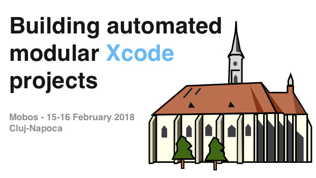

## Workshop's goal

The goal of the workshop is to learn the elements below:

- ✅ Why modularizing projects helps with scaling apps.
- ✅ The definitions of *library/framework*, *static/dynamic* and how they are represented in Xcode projects.
- ✅ How to create a module (framework/library) project.
- ✅ How to link *(connect)* modules.
- ✅ How Carthage works and how to use to to fetch external modules.
- ✅ Generation of Xcode projects using [XcodeGen](https://github.com/yonaskolb/XcodeGen) and getting rid of the Xcode projects from the git repository.
- ✅ Task automation using [Sake](https://github.com/xcodeswift/sake).

## On this repository
- [GitHubKit](/Projects/GitHubKit): Framework that cointains the components to interact with the GitHub API.
- [IssuesKit](/Projects/IssuesKit): Framework that cointains the app business logic.
- [App](/Projects/App): iOS application that shows the user assigned GitHub issues.
- [Slides](/slides): The workshop slides.

## Questions
If you have any question that wasn't addressed during the workshop, feel free to use the repository issues to get some support.

## Pre-requisites
- [Homebrew](https://brew.sh)
- [Xcode 9.2](https://developer.apple.com/xcode/)

## References
- [GitHub API v3](https://developer.github.com/v3/)
- [XcodeGen](https://github.com/yonaskolb/xcodegen)
- [Sake](https://github.com/xcodeswift/sake)

## Tags
- **0.1.0**: Functional project with the iOS application.
- **0.2.0**: GitHubKit project can be generated.
- **0.3.0**: IssuesKit project can be generated.
- **0.4.0**: App project can be generated.
- **0.5.0**: iMessage extension generated.
- **0.6.0**: IssuesUI target created.
- **0.7.0**: Implement iMessage view controller.
- **0.8.0**: Migrate from Rake to Sake.

## License

```
Copyright 2018 Pedro Piñera

Permission is hereby granted, free of charge, to any person obtaining a copy of this software and associated documentation files (the "Software"), to deal in the Software without restriction, including without limitation the rights to use, copy, modify, merge, publish, distribute, sublicense, and/or sell copies of the Software, and to permit persons to whom the Software is furnished to do so, subject to the following conditions:

The above copyright notice and this permission notice shall be included in all copies or substantial portions of the Software.

THE SOFTWARE IS PROVIDED "AS IS", WITHOUT WARRANTY OF ANY KIND, EXPRESS OR IMPLIED, INCLUDING BUT NOT LIMITED TO THE WARRANTIES OF MERCHANTABILITY, FITNESS FOR A PARTICULAR PURPOSE AND NONINFRINGEMENT. IN NO EVENT SHALL THE AUTHORS OR COPYRIGHT HOLDERS BE LIABLE FOR ANY CLAIM, DAMAGES OR OTHER LIABILITY, WHETHER IN AN ACTION OF CONTRACT, TORT OR OTHERWISE, ARISING FROM, OUT OF OR IN CONNECTION WITH THE SOFTWARE OR THE USE OR OTHER DEALINGS IN THE SOFTWARE.
```